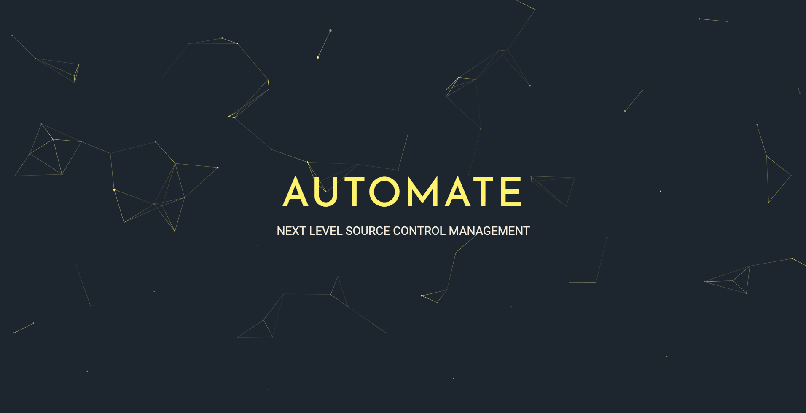

# automate
Created with Electron JS and integrating with both Azure DevOps and GitHub, automate allows you to automate tasks such as changing branches across enterprise workspaces and solutions, tagging multiple repositories at the same time, and much more.

 

## Getting Started
Make sure that you have [Node.js](https://nodejs.org/en/) installed. The minimum required version is 14.

## Configuration
There are three configuration requirements for running automate:

 - `config.json`: This is the primary configuration data.
 - `flux.json`: This is configuration data that can be overridden.
 - `secrets.json`: As the name implies, this is secret configuration data.

### Flux Data
The `flux.json` file is considered the primary configuraiton for running automate in a standardized environment. In order to override the data in this configuration file, simply create a file in the same directory named `flux.dev.json` and override the existing values. The `flux.dev.json` file is ignored using the `.gitignore` file, so it won't be commited to source control at any point.

Contrary to popular belief, `flux.dev.json` isn't representing a developer file, it's representing a deviation for the `flux` data.

### Secrets
The `secrets.json` file is an empty shell representing all of the configurable secret data in the application. In order to use the application, you'll need to create a copy of this file named `secrets.dev.json` and populate it with your personal data.
